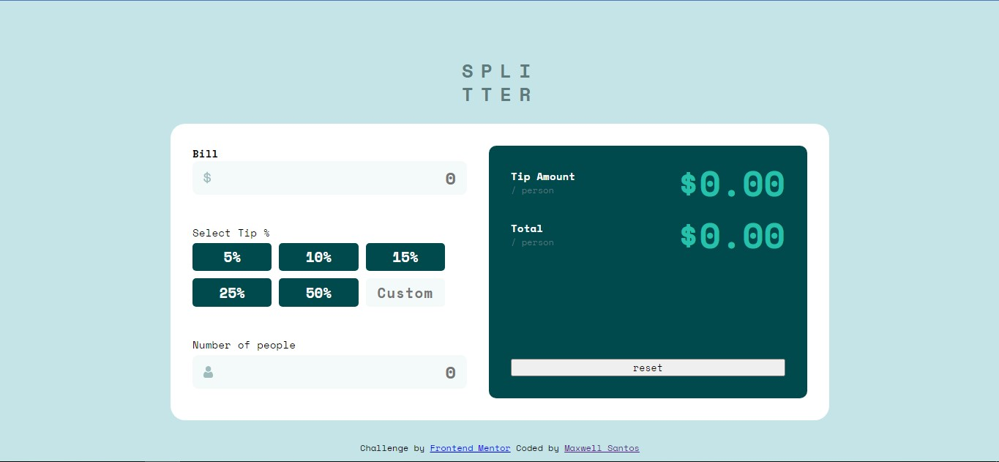
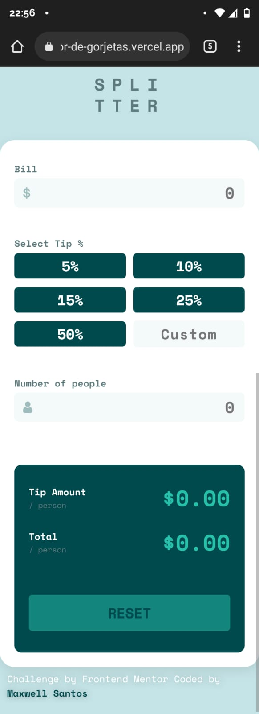
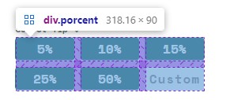

## Table of contents

- [Overview](#overview)
  - [Screenshot](#screenshot)
  - [Links](#links)
- [Meu processo](#my-process)
  - [Construído com](#built-with)
  - [O que eu aprendi](#O-que-eu-aprendi)
  - [Reset disabled](#Reset-disabled)
  - [Tratamento de erros](#Tratamento-de-erros-para-valores-null)
- [Autor](#autor)
- [Agradecimentos](#Agradecimentos)

**Note: Delete this note and update the table of contents based on what sections you keep.**

## Overview

<style>
 .img{display: grid; grid-template-columns: 1fr 300px; grid-template-rows: 1fr;}
 img{width: 100%; height: 100%;}
</style>

### Screenshot

<div class="img">




</div>

### Links
- Solution URL: [Solução](https://www.frontendmentor.io/solutions/tip-calculator-r1QVkyWSc)
- Live Site URL: [link do site](https://calculador-de-gorjetas.vercel.app/)

## Meu processo

### Construído com

- Semantic HTML5 markup
- CSS custom properties
- Flexbox
- CSS Grid
- Responsiveness
- Variables for colors
- Gsap which is animation when entering the site

### O que eu aprendi

<p>Esse atributo js serve para definir uma quantidade de character máximo ao input do type number, nesse caso eu coloquei 3, pois esse input recebe um valor de porcentagem digitado pelo usuário, como no máximo é 100%, o usuário fica limitado a digitar 3 números e no index.js verifica se ele é maior ou menos que 100 </p>

```html
<input type="number" id="custom-porcent" class="porcent-item" value="" placeholder="custom" onkeypress="OnClickEnter(event)" oninput="javascript: if (this.value.length > this.maxLength) this.value = this.value.slice(0, this.maxLength);" maxlength="3">
```
<p>Aqui é uma das células de porcetagem pré definido</p><br>
<p>Essa função é chamada para cada porcentagem pré definidada, e tem como parâmetro o valor da porcentagem desejado para fazer o calculo</p>

```html
<button type="button" class="porcent-item" name="item" onclick="calcPercentage('5')"> 5% </button>
```
```css
/*serve para tirar as setas que ficam de quando o input é do tipo number*/
input[type=number]::-webkit-inner-spin-button,
input[type=number]::-webkit-outer-spin-button {
  -webkit-appearance: none;
  -moz-appearance: none;
  appearance: none;
  margin: 0;
}
```
- São 3 inputs que o usuário consegue escrever algum valor. Caso algum deles não forem de acordo com o esperado, as bordas ficam vermelhas, avisando que há algo de errado com aquele input, e o js se encarrega de alertar o que está errado

<p>Ex: clicar Enter para fazer o calculo, porém não preencheu um dos campos</p>


```css

/*Quando clica Enter, e algum desses input não forem preenchidos, o js adiciona essa class "active"*/
#one.active, #two.active, #custom-porcent.active{
  border: 2px solid rgb(248, 64, 64);
}

/*Caso seja um valor válido, ex: diferente de vazio*/
/*ou no caso da #custom-porcent, também verifica se o valor é abaixo de 100 (daí ele se torna válido)*/
/*As bordas voltam ao normal, indicando que está tudo certo naquele campo*/
#one.active:valid, 
#two.active:valid, 
#custom-porcent.porcent:valid{
  border: 2px solid var(--input-bg-color);
}

```
- Na div das porcentagens, distribuí com <code>display: grid</code>, para facilitar na manipulação das células e posicionar de acordo com o tamanho da tela 



```css
.porcent {
  display: grid;
  grid-template-columns: 1fr 1fr 1fr; /*Serão 3 colunas com a largura responsiva*/
  grid-template-rows: 1fr 1fr; /*duas linhas com a largura responsiva*/
  gap: 10px; /*um espaço de 10px entre eles */
  align-items: center; /*cada item está posicionado ao centro de sua respectia célula*/
}

```
### Reset disabled

<p>O botão reset apenas liga quando todo os campos forem preenchidos</p>


### Tratamento de erros para valores null 

```js

//this function is called when click enter on some input
function OnClickEnter(event) {
  var x = event.keyCode;

  if (x == 13) { //13 is the code of button enter on keyboard

    //se os campos obrigátórios n estiverem preenchido, faça isso
    //if the required fields are not filled, do this
    if (price.value == '' && persons.value == '' && custom_porcent.value == '') {

      alert('fill in the fields')
      controlBorders();

      
    } else if(price.value == '' && persons.value !== '' && custom_porcent.value == ''){
      alert('fill in the bill field')
      price.focus();


    } else if (price.value !== '' && persons.value == '' && custom_porcent.value == '') {
      alert('Fill in the Number of People field')
      persons.focus();
      
      //se não, se os campos obrigatórios estiverem preenchidos mas o usuário não definiu uma porcentagem, faça isso
      //if not, if the required fields are filled in but the user has not set a percentage, do so
    } else if (price.value !== '' && persons.value !== '' && custom_porcent.value == '') {

      alert('Choose a percentage, or set a value of your own')
      custom_porcent.focus()

      /*Caso todos os casos forem resolvidos, e nenhuma porcentagem for escolhida, vai verificar se definiu algum valor no custom-porcent*/
    } else {

      if (custom_porcent.value > 100) {//o valor máximo da porcentagem e 100%

        alert('the maximum value is 100')

        custom_porcent.value = ''
        custom_porcent.focus()

      } else {
        customPercentage(custom_porcent.value) //ele manda como parâmetro o valor digitado

      }

    }
  }
}
```

```js
function customPercentage(customPorcent) { //Esse parâmetro é o custom_porcent.value
  calcPercentage(customPorcent)
}
```

<p>Ou seja, essa função <code>calcPercentage()</code>de calcular pode receber como parâmetro tanto o valor pré definido no html, quanto um valor customizado</p>

```html
    <button type="button" class="porcent-item" name="item" onclick="calcPercentage('5')"> 5% </button>
```

```js
function show(tipForPerson, totalforPerson) { // this function show the result on screen
  tip_person_amount.innerHTML = tipForPerson.toFixed(2) //limits decimal places to two places
  total_person.innerHTML = totalforPerson.toFixed(2) //same thing to total_person
}

function calcPercentage(porcent) { //calc porcentage of tip

  const newPorcent = porcent / 100 //translate porcentage to decimal

  const tipForPerson = (price.value * newPorcent) / persons.value //calc tip for person  
  const totalforPerson = (price.value / persons.value) + tipForPerson

  if (price.value == '' || persons.value == '') {
    alert('preencha os campos')

    controlBorders(); //função global para não ficar repetidno código sempre que precisar alterar classes

  } else {
    show(tipForPerson, totalforPerson)
    reset.disabled = false //active button reset

  }
}
```

```js
function controlBorders() {
  price.classList.add('active') //active danger border
  persons.classList.add('active') //active danger border
  custom_porcent.classList.add('active') //active danger border

}
```
## Autor

- Frontend Mentor - [@Maxwell-Santos](https://www.frontendmentor.io/profile/Maxwell-Santos)

## Agradecimentos

Eu gostaria de agradecer minha namorada, ela é programadora também e me ajudou construir o site, ela é um pilar para mim.

